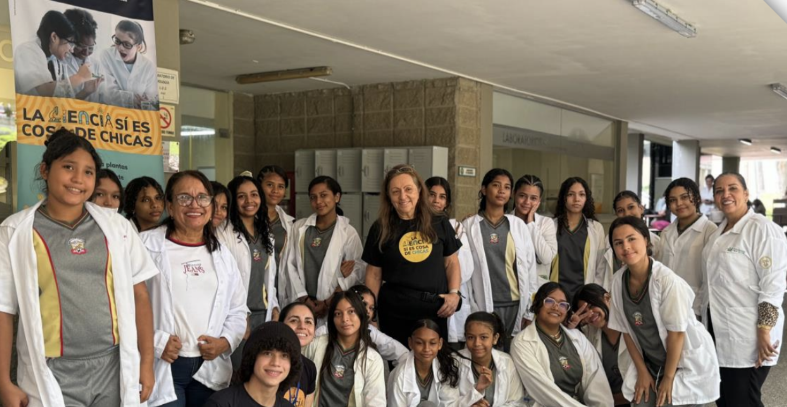

# Introducción

La iniciativa “La Ciencia sí es cosa de Chicas” surge como respuesta a una brecha persistente de participación y representación de las mujeres en áreas STEM, que no solo limita trayectorias individuales, sino que reproduce desigualdades sociales y económicas. En particular, hay una etapa crítica entre los 12 y 15 años, cuando muchas niñas empiezan a desinteresarse por la ciencia y a experimentar con más fuerza estereotipos de género que desalientan su confianza e intención de continuar en estos campos. En esa misma línea, los datos que sustentan el diagnóstico muestran una brecha temprana en aspiraciones (por ejemplo, una proporción muy baja de niñas considerando carreras tecnológicas frente a los niños), lo que refuerza la necesidad de intervenciones oportunas y sostenidas.

Ante este contexto, la iniciativa se diseñó para contrarrestar esa pérdida temprana de interés mediante experiencias directas, prácticas y acompañadas: talleres y laboratorios para niñas de 8°, 9° y 10° que les permitan experimentar, preguntar y verse a sí mismas como futuras científicas, conectando su curiosidad con oportunidades reales de aprendizaje y referentes.

## ¿Que es la Ciencia si es cosa de Chicas?

La Ciencia sí es Cosa de Chicas es una iniciativa de divulgación que empodera a niñas de 13 a 17 años de la región Caribe colombiana, específicamente en el Departamento del Atlantico. Las niñas participantes provienen tanto de colegios públicos como privados, que con frecuencia carecen de acceso a laboratorios de Ciencias y semilleros o clubes de investigación, para explorar la Ciencia, la Tecnología, la Ingeniería y las Matemáticas (STEM). El programa busca generar espacios para las niñas donde puedan explorar la Ciencia de forma experiencial, conectando a las participantes con modelos de rol femeninos inspiradores, así como con investigadores comprometidos con la Ciencia como un espacio para todos y todas.

# Objetivos

1.  Promover equidad y acceso en STEM: brindar oportunidades para que las niñas (sin importar el tipo de colegio) participen en experiencias extracurriculares inclusivas y de alta calidad, que con frecuencia no están disponibles en su formación formal.

2.  Fortalecer confianza y motivación: reforzar conocimientos científicos y promover la autoconfianza mediante talleres interactivos y experimentos que potencien sus habilidades y curiosidad en STEM.

3.  Conectar con modelos de rol para inspirar futuros: ofrecer mentoría conectando a las participantes con mujeres exitosas en STEM, mostrando que seguir una carrera científica es posible y profundamente transformador. A través del aprendizaje práctico y el contacto con científicas/os reales, creamos un espacio donde las niñas pueden descubrir, preguntar, disfrutar y proyectarse como futuras líderes en STEM.

# Metodología

En el año se realiza una agenda de sesiones (entre 11 y 12 sesiones). Posteriormente esta agenda se comparte a colegios de la región, tanto públicos como privados. Se gestiona a través del colegio participante el consentimiento informado y uso de imagen de las niñas. Al ser menores de edad, los firmantes son sus padre/madres o tutor legal. El colegio se encarga de llevar las niñas a los laboratorios/espacios de la Universidad del Norte donde se desarrollan las actividades.

Las actividades están orientadas hacia diferentes campos de las Ciencias como:

- Biología y Ciencias de la Salud: exploración de células, extracción de ADN y fisiología usando microscopios e indagación guiada.

- Ciencias Ambientales y de la Tierra: simulaciones del ciclo del agua, formación de montañas y cambio climático.

- Química y Energía: reacciones químicas, combustible de hidrógeno y materiales biodegradables.

- Física y Astronomía: fenómenos ópticos, electromagnetismo y observación del cielo. • Matemáticas y Ciencia de Datos: decodificación de mensajes, visualización de datos y resolución de problemas reales.

- Ingeniería: retos prácticos como construir filtros, energías limpias, o funcionamiento de circuitos para fomentar creatividad y trabajo en equipo.

Las actividades pueden ser lideradas por investigadoras regionales, nacionales o internacionales enriqueciendo su comprensión sobre la ciencia a nivel global. La sesión cubre los materiales/reactivos que se requieran en el laboratorio, y un refrigerio para cada participante. Una vez finaliza la actividad, se realizar un evaluación de la misma sobre la percepción de las participantes en el espacio STEM.

Contamos con un sitio web oficial con información del programa y el formulario de inscripción para participar en las actividades: <https://www.uninorte.edu.co/web/ciencias-basicas/la-ciencia-si-es-cosa-de-chicas>

# Resultados

Se han desarrollado un total de 26 sesiones en diversas áreas STEM: 6 en Biología, 1 en Ciencias Ambientales, 1 en Ciencias de la Salud, 2 en Física, 3 en Geología, 1 en Astronomía, 4 en Matemáticas, 5 en Química, 2 en Ingeniería y 1 enfocada en Mujer y Ciencia. Estas sesiones reflejan nuestro compromiso con ofrecer una exposición científica amplia e inclusiva para niñas, promoviendo la exploración de múltiples disciplinas. Cada sesión está diseñada para ser interactiva e inspiradora, con el objetivo de fortalecer desde etapas tempranas la curiosidad y la confianza en STEM. En total han participado 24 instituciones, de las cuales el 58,3% son Instituciones públicas y el 47,7% son colegios privados. Han participado un total de 612 personas, de las cuales 507 son niñas entre los 13 a los 16 años. De las demás el 5% corresponde a las talleristas, el 2 % estudiantes de grupos estudiantiles que apoyan el desarrollo de algunas sesiones, el 8% son profesores de los colegios que nos visitan con sus chicas, y el restante, corresponde a niñas voluntarias que se han querido unir a la organización de algunas actividades.

# Conclusiones

La buena práctica ha permitido abrir oportunidades reales de acceso a experiencias STEM para niñas de distintos contextos escolares, especialmente aquellas con escaso o nulo acceso a laboratorios, clubes de ciencia o referentes científicos cercanos. Dentro de las participantes hay niñas de colegios de estrato 1 y 2, y de Municipios rurales del Departamento del Atlantico, lo que permite evidenciar la importancia de la equidad en espacios STEM.

Se evidencio que los talleres prácticos, con experimentación guiada, generan un efecto potente en la autoconfianza: las niñas pasan de la duda inicial (“no soy buena para esto”) a la vivencia concreta de “sí puedo” al resolver retos, manipular equipos y explicar lo que observaron. El aprendizaje clave es que la motivación crece cuando la ciencia se vive como experiencia (entender, probar, equivocarse y volver a intentar), no como memoria. De acuerdo a los resultados de percepción se evidencia que las niñas reconocer que las ayudo a motivarse hacia las actividades el ambiente seguro que se genero durante el proceso, así como la oportunidad de preguntar sin sentirse juzgadas.

La interacción con mujeres científicas y mentoras cercanas ha mostrado ser un componente decisivo: humaniza la carrera científica, ofrece rutas concretas (qué estudiar, cómo se llega, qué obstáculos existen) y combate estereotipos al mostrar referentes “de carne y hueso”, del mismo territorio. El aprendizaje principal es que el modelo de rol funciona mejor cuando hay diálogo y cercanía, no solo una charla. El liderazgo de las sesiones por diferentes científicas, tanto regionales, nacionales e internacionales, les mostró a las niñas participantes, que hay retos, pero también que se pueden superar, y que los miedos que aveces sentimos, también han sido experimentados por otras mujeres que ya tienen un importante reconocimiento. Que la Ciencia es un camino que cada persona construye con sus propios sueños.

Como limitaciones y dificultades, se han evidenciado retos logísticos recurrentes: como la coordinación de horarios escolares, con los horarios de clases en la Universidad, los permisos que se diligencian (por ser niñas menores de edad), el transporte desde los colegios a la Universidad. Adicionalmente, el programa requiere una alta carga de organización para asegurar insumos, bioseguridad y acompañamiento. También se reconoce que el impacto a mediano y largo plazo es más difícil de medir si no se cuenta con un sistema de seguimiento de participantes (egresadas) y con indicadores sostenidos. Finalmente, la disponibilidad de recursos y tiempo del equipo (y de mentoras invitadas) puede limitar la frecuencia de actividades o su expansión territorial.

Como propuestas de mejora a futuro, se plantea: (i) consolidar un modelo de seguimiento de participantes (línea base y mediciones posteriores) para documentar cambios en interés, autoconfianza y decisiones académicas; (ii) fortalecer un banco de mentoras del Caribe y una ruta de mentoría continua (no solo talleres puntuales); (iii) ampliar alianzas con colegios y actores locales para facilitar logística y garantizar continuidad; (iv) asegurar fuentes de financiación sostenibles para ampliar cobertura, mantener la calidad y escalar progresivamente a más municipios de la región.

# Recomendaciones

Anclar la iniciativa en alianzas locales: articular universidad–colegios–secretarías de educación–organizaciones comunitarias para facilitar convocatoria, temas logísticos, financieros y de continuidad (especialmente en zonas rurales o municipios cercanos).

Mantener el enfoque en la edad crítica (13–16): replicar el modelo en secundaria, donde suelen intensificarse estereotipos de género y disminuye la confianza en STEM.

Aprendizaje basado en experiencia, no en teoría: usar talleres cortos, seguros y altamente prácticos, con preguntas guiadas, retos y experimentos que conecten con problemas del entorno (agua, salud, clima, energía, datos).

Modelos de rol cercanos y diversos: invitar mentoras de la región (idealmente con trayectorias variadas: academia, industria, sector público) y a mentoras nacionales e internacionales de ser posible, (las chicas reconocen que interactuar con personas que han superado barreras de diferente nivel, les permite identificarse con las investigadoras y darle sentido de realidad a sus intereses en las Ciencias).

Estandarizar un “paquete replicable”: manual operativo + cronograma + lista de materiales + protocolos de bioseguridad + formatos de consentimiento y registro, para facilitar la implementación en otras instituciones. Compartir las lecciones aprendidas, y los tips ganadores, para evitar tiempos y esfuerzos en iniciativas que tengan un alcance que tal vez no se pueda lograr al ser muy ambicioso.

Medición simple y útil: aplicar instrumentos breves que puedan ser realizados por las chicas participantes, su percepción es fundamental para el éxito de estas iniciativas.

Escalamiento gradual: empezar con piloto (1–3 colegios), ajustar con retroalimentación y luego ampliar por cohortes, cuidando siempre la experiencia de calidad como “mínimo no negociable”.

# Referencias

ONU MUJERES, Mayo, 2020. Publicación Las Mujeres en Ciencias, Tecnología, Ingeniería Y Matemáticas en América Latina y el Caribe.

# Recursos

Podes leer mas del trabajo original entrando [aqui](https://drive.google.com/open?id=1rXs3Xjhjgijbub-Z0g-AEBUEFM69ID9G).
