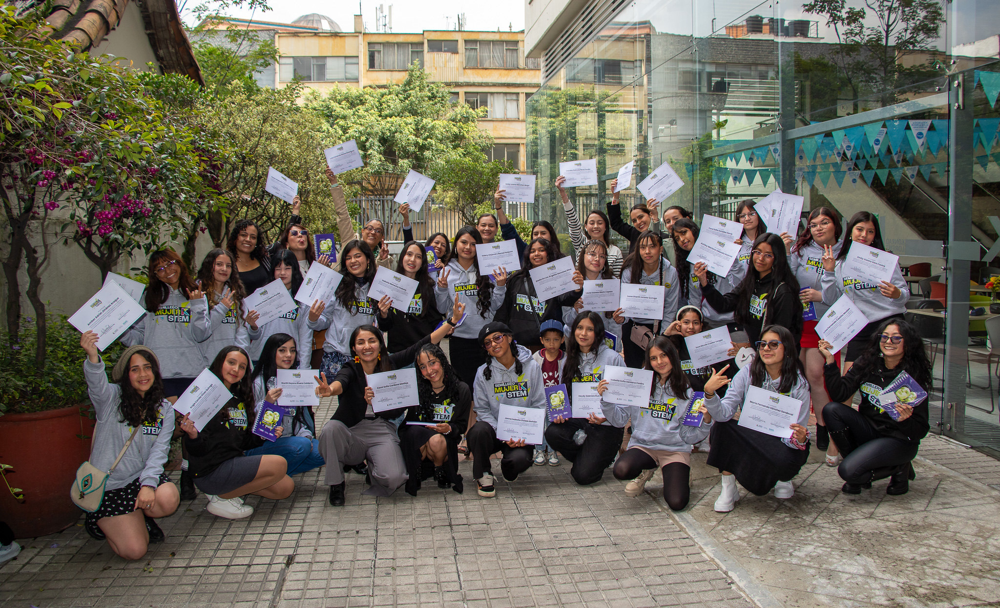
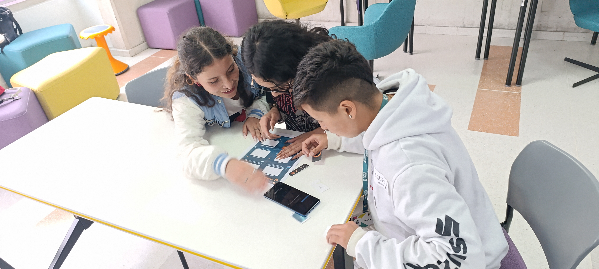
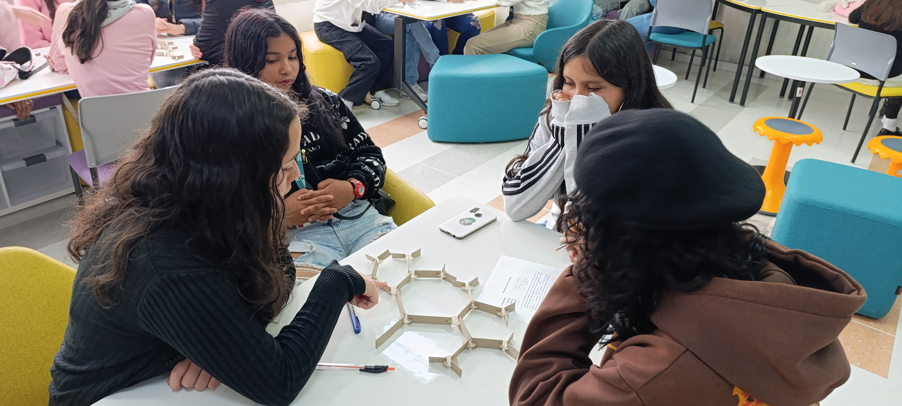
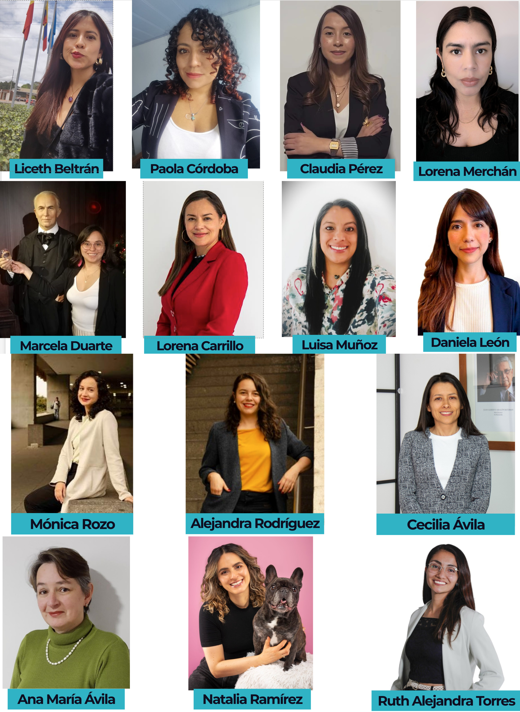
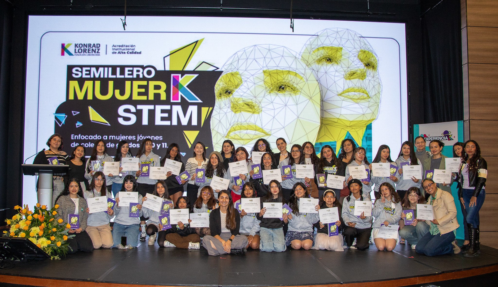

# Introducción

La baja participación de mujeres en áreas STEM sigue siendo un reto en América Latina, asociado principalmente a barreras sociales, culturales y de acceso a oportunidades. Factores como la falta de referentes cercanos, los estereotipos de género, la información limitada sobre trayectorias profesionales y las condiciones socioeconómicas influyen en la forma en que muchas jóvenes se relacionan con estas áreas y proyectan sus decisiones vocacionales. En este sentido, el desafío no es únicamente el acceso al conocimiento, sino la posibilidad de resignificarlo como una opción cercana y viable.

En este escenario, surgió la necesidad de diseñar una iniciativa que permitiera acercar a estudiantes de educación media a las áreas STEM desde una experiencia más cercana y práctica, que reconociera la diversidad de trayectorias, intereses y contextos desde los cuales las jóvenes se aproximan a estas disciplinas.

# Desarrollo

El Semillero Mujer-K-STEM nació como un espacio extracurricular dirigido a mujeres jóvenes en etapa escolar para explorar las áreas STEM a través de experiencias prácticas, conversaciones formativas, el acompañamiento de mujeres con trayectorias diversas. La propuesta se estructuró como una experiencia en la que la formación STEM estaría transversalizada por herramientas y conversaciones orientadas a responder a otras necesidades propias de la etapa de vida de las participantes y de sus contextos, integrando así la exploración académica con el desarrollo personal.

La primera versión fue posible gracias al respaldo de la Fundación Universitaria Konrad Lorenz y el apoyo del *SIAM EDI Change Agent Program* de la Society for Industrial and Applied Mathematics (SIAM), una iniciativa internacional orientada a fortalecer la equidad, diversidad e inclusión en matemáticas y sus comunidades (Castillo et al., 2026).

El concepto de “semillero” se entendió como un espacio para iniciar procesos, despertar intereses, hacer preguntas y ampliar horizontes. La propuesta se diseñó como un entorno seguro, no competitivo y cercano, orientado a facilitar la exploración de distintas áreas STEM desde la experiencia, al tiempo que promovía la reflexión sobre decisiones personales y trayectorias de vida.

El semillero se desarrolló a lo largo de nueve sesiones realizadas los días sábados, estructuradas en dos momentos complementarios: un espacio de exploración STEM y un espacio de formación integral. Adicionalmente, se incluyó una sesión de conversación con estudiantes y egresadas de áreas STEM, así como una ceremonia de cierre con familiares y acudientes, en la que se compartieron los aprendizajes y procesos vividos.

El diseño incorporó varios componentes metodológicos clave:

1.  **Un acercamiento a STEM desde experiencias prácticas y accesibles.** Se utilizaron el juego, los retos y el trabajo colaborativo para que las estudiantes se acercaran a conceptos de ingeniería, matemáticas, física, astronomía, desarrollo de videojuegos, entre otros, en un ambiente cómodo. Esta aproximación buscó contrarrestar la idea de que STEM es un campo reservado únicamente para quienes ya “son buenas” en matemáticas o ciencias. Al trabajar con materiales concretos, dinámicas colaborativas y actividades creativas, las jóvenes pudieron aproximarse a los contenidos sin la presión asociada al rendimiento académico, abriendo espacio para el descubrimiento de intereses. 

    

    

2.  **La experiencia de estar en un entorno universitario.** Realizar el semillero en la Fundación Universitaria Konrad Lorenz tuvo un impacto tangible en las participantes, especialmente en aquellas provenientes de contextos de menor acceso a educación superior. Recorrer el campus, trabajar en laboratorios, participar en talleres en salones universitarios e interactuar con profesoras que forman parte de la institución contribuyó a disminuir la distancia simbólica entre la escuela y la universidad. Esta familiaridad temprana ayuda a que el acceso a la educación superior se perciba como una posibilidad más cercana y alcanzable. 

3.  **La participación de profesoras universitarias como facilitadoras.** El equipo estuvo conformado por 14 profesoras, 13 de la Fundación Universitaria Konrad Lorenz y una colaboradora externa, de áreas como matemáticas, física, ingeniería, psicología, sociología, mercadeo y artes. Esta diversidad disciplinar permitió que las estudiantes encontraran modelos de referencia más amplios: mujeres con trayectorias científicas, tecnológicas, artísticas y sociales que trabajan con STEM desde distintas perspectivas. En un contexto donde la representación femenina sigue siendo limitada en varios campos de la ciencia y la tecnología, contar con un grupo amplio de profesoras contribuyó a mostrar que las mujeres han construido y siguen construyendo caminos en estos ámbitos. 

    

4.  **La vinculación de estudiantes y recién graduadas como referentes cercanos en edad.** Además del equipo docente, participaron estudiantes y egresadas de matemáticas e ingenierías, quienes compartieron sus experiencias en un espacio de diálogo horizontal. En este encuentro se abordaron temas como la elección vocacional, la vida universitaria, los retos y los aprendizajes, lo que permitió a las participantes plantear preguntas, compartir inquietudes y reconocer experiencias similares.

5.  **La incorporación de un enfoque integral para el crecimiento personal.** El semillero incluyó sesiones sobre bienestar, autocuidado, hábitos saludables, gestión emocional, toma de decisiones y reconocimiento de las brechas de género. También se brindó información sobre becas y oportunidades educativas. Estas actividades respondieron a la necesidad de acompañar no solo los intereses académicos, sino también los procesos personales que influyen en la construcción de trayectorias.

6.  Este conjunto de elementos permitió que la experiencia no se limitara a actividades técnicas, sino que integrara dimensiones personales, académicas y sociales que suelen influir en la elección de carreras relacionadas con ciencia y tecnología. 

# Resultados

La convocatoria del semillero recibió 49 postulaciones y se conformó un grupo final de 24 estudiantes que participaron de inicio a fin en el año 2025. Todas estaban entre los 14 y 18 años: 5 cursaban grado noveno, 10 cursaban décimo y 9 cursaban once, último grado de educación media en Colombia. 21 de las 24 estudiantes provenían de colegios públicos de Bogotá y 17 pertenecían a los estratos 1 y 2, los niveles socioeconómicos más bajos de la ciudad en una escala que va del 1 al 6. La diversidad de procedencias y condiciones de las participantes mostró que las jóvenes llegan a las áreas STEM desde experiencias escolares, familiares y sociales muy distintas. Esto resaltó la importancia de diseñar iniciativas que reconozcan las desigualdades existentes y ofrezcan oportunidades de exploración adaptadas a realidades distintas 

Los resultados de la encuesta de cierre mostraron impactos significativos: en una escala de 1 a 5, las participantes reportaron un promedio de **4,38** respecto a sentirse más interesadas en las áreas STEM; **4,43** en haber aprendido más sobre profesiones relacionadas; y **4,29** en su interés por estudiar una carrera en el campo. La afirmación con mayor puntuación fue la relacionada con la creencia de que las mujeres se pueden involucrar más en profesiones STEM, con un promedio de **4,62**. La satisfacción general alcanzó un valor de **4,71**.  

Las respuestas abiertas complementaron estos resultados. Algunas jóvenes señalaron que lograron mayor claridad sobre lo que desean estudiar; otras destacaron que descubrieron habilidades que no conocían. Varias valoraron los espacios de interacción con profesoras, estudiantes y recién graduadas, en los que pudieron compartir dudas, expectativas y decisiones, y mencionaron que no habían tenido antes la oportunidad de conocer tantas mujeres con formación en áreas tan diversas, lo que amplió su visión sobre las posibilidades profesionales. También indicaron que recomendarían la experiencia a otras estudiantes, incluso a aquellas que no se sienten inicialmente atraídas por las matemáticas o las ciencias.

# **Conclusiones**

La experiencia del Semillero Mujer-K-es-STEM muestra que el acercamiento a las áreas STEM puede fortalecerse cuando se articula con un enfoque de formación integral que reconozca las dimensiones personales, sociales y académicas de las decisiones vocacionales. La combinación de exploración práctica, espacios de reflexión y referentes cercanos permitió generar un impacto que trasciende el aprendizaje técnico, incidiendo en la confianza, la toma de decisiones y la proyección de las participantes.

El desarrollo del semillero permitió aprovechar las fortalezas institucionales de la universidad, especialmente en términos de infraestructura, diversidad disciplinar y talento humano, lo que facilitó la construcción de una experiencia más completa. A partir de esto, se evidencia que la propuesta es adaptable a distintos contextos, ya que puede ajustarse a las capacidades institucionales y a las necesidades específicas de las poblaciones con las que se trabaje.

Las sesiones de formación para la vida tuvieron un papel especialmente relevante en la construcción del ambiente del semillero. Estas generaron condiciones de confianza que facilitaron la participación activa, el intercambio de ideas y la reflexión personal. En particular, los espacios de orientación vocacional y de acceso a becas y oportunidades educativas fueron altamente valorados por las participantes, ya que contribuyeron a ampliar su perspectiva sobre sus trayectorias posibles.

Entre los principales aprendizajes se destaca la importancia de generar espacios seguros y no competitivos, así como de integrar componentes de formación para la vida en iniciativas STEM. Asimismo, se identificó que la diversidad de referentes y la interacción con mujeres en distintas etapas de formación fortalecen la percepción de viabilidad de estos caminos.

Como limitaciones, se reconoce el alcance reducido en el número de participantes del programa y la necesidad de asegurar su sostenibilidad a largo plazo. En este sentido, se plantea como proyección la continuidad del semillero y la articulación con otras iniciativas en Colombia y Latinoamérica que permitan ampliar su cobertura.

En conjunto, esta experiencia se configura como una buena práctica que puede contribuir al cierre de brechas de género en STEM, ofreciendo un modelo replicable que integra exploración disciplinar y formación integral, y que puede adaptarse a distintos contextos educativos.

# **Referencias**

Castillo, A., Minenkova, A., Newman, E., & Torres-Rubiano, R. A. (2026, febrero 23). *Reflections on the SIAM EDI Change Agents Program*. SIAM News. [https://www.siam.org/publications/siam-news/articles/reflections-on-the-siam-edi-change-agents-program/](https://www.siam.org/publications/siam-news/articles/reflections-on-the-siam-edi-change-agents-program/?utm_source=chatgpt.com)
